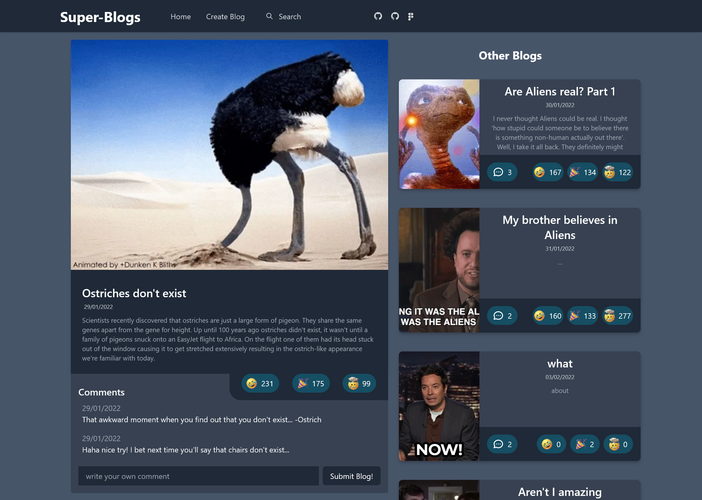

# Welcome to Super-Blogs!

The anonymous blogging site for your craziest stories!  
Want to tell people about your wildest conspiracy theories? **_Go for it!_**  
Want to see what people think of your new short story? **_Get it submitted!_**  
Even if you just want to tell the world about the fact you eat cold baked beans without them tracing it back to you, then this is still the perfect place to do it!

## Table of Contents

- [Installation & Usage](#installation--usage)
  - [Installation](#installation)
  - [Local Usage](#usage)
  - [Deployment](#deployment)
- [See the Sites](#see-the-sites)
- [Technologies](#technologies)
- [Changelog](#changelog)
- [Wins & Challenges](#wins--challenges)
  - [Wins](#wins)
  - [Challenges](#challenges)
- [Bugs](#bugs)
- [Goals for the Future!](#goals-for-the-future)

## Installation & Usage

### Installation

- Clone or download the repo
- Navigate to the super-coders folder at the command line
- Run `npm install` to install dependencies

### Local Usage

- Run `npm start` to compile the source code
- Go in to `index.html` and start a live server

### Deployment

- View the client live on [Netlify](https://super-coders.netlify.app/)

#### Testing

- While in the super-coders folder run `npm test` to launch the test suite

## See the Sites

#### Create your own blog...

#### ...or just read everybody elses!

## Technologies used

#### Planning & Design Tools

- Github Projects - view our Kanban board in this repo
- Figma ([View our template here](https://www.figma.com/file/irC9SOqgXFVlGknEMVmSn9/super-coders?node-id=2%3A3))

#### HTML/CSS Tools

- Tailwind Framework
- Browserify

#### JavaScript Tools

-

## Changelog

#### HTML/CSS

- init commit
- configure Tailwind and Prettier
- add tailwind template to index.html
- create createBlog.html with basic form
- add navbar to createBlog.html
- add homepage images
- add blog page w/ comments
- create navbar, footer, and card templates
- reactive blog page
- create blog template
- emojis added to cards
- add comment form to blog.html
- style blogTemplate
- fix cards to be more responsive
- fix chrome and light mode layouts

#### JavaScript

- add functionality to hamburger menu
- set up fetch requests in handlers.js
- add createBlog.html page update on form submit
- finish request to fetch all blogs
- request specific blog by id
- set up PATCH request to update emoji count
- DELETE request to delete a blog
- update blog card content using api
- form submission working
- link between index.html and blog.html
- add gif fetch request to POST request
- new comments print to blog.html
- set up emoji updating
- functional search w/ error handling
- emoji updates with server

## Wins & Challenges

### Wins

- Using CSS framework for almost all styling
- Fully responsive website working on desktop and mobile
- Functional search bar
- Working emoji selection on blog posts
- Linking html pages using `window.sessionStorage`
- Integrating the Giphy API

### Challenges

- Maintaining TDD
- Testing presence of html elements due to template usage
- Setting up forms to communicate with Giphy API and Heroku
- Linking `index.html` with `blog.html`

## Bugs

- fix bug on initial page load (89528b9)
- security

## Goals for the Future!

- Add blog preview to desktop version of `createBlog.html`
-
-

## minimum viable product

### Prework

- [x] write this README
- [x] design using figma
- [x] fill kanban board

### functionality

- [x] anonymous posts
- [x] character limit 500 characters
- [x] intergrate giphy api
- [x] view other people's entries
- [x] react to post with an emoji
- [x] comment on other people's posts

### technical

- [x] 60% test coverage
- [x] deploys on netlify

### technologies

- [x] express
- [x] cors
- [x] concurrently -DEV
- [x] watchify -DEV
- [x] jest -DEV
- [x] supertest -DEV
- [x] nodemon -DEV
- [x] jest-fetch-mock -DEV
- [x] tailwindCSS -DEV

#### Fun extras

- [x] fuse.js -fuzzy searching
